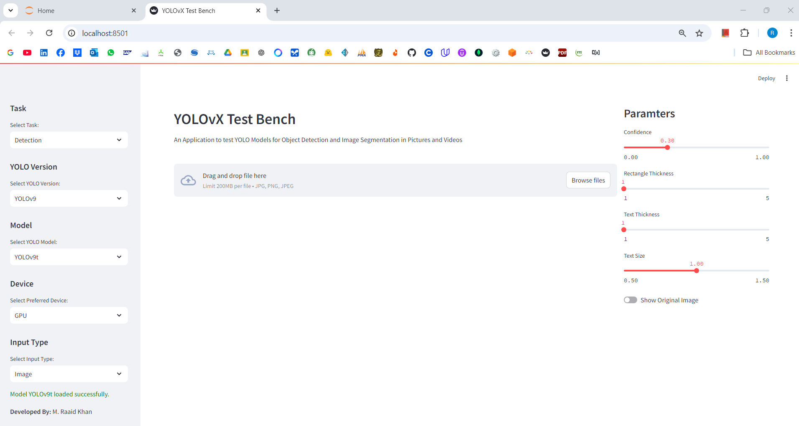
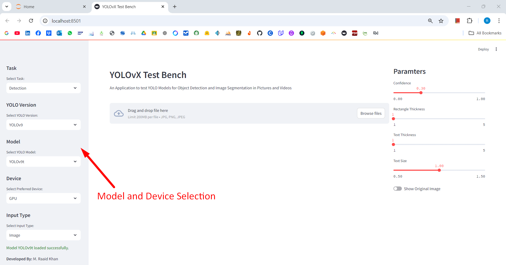
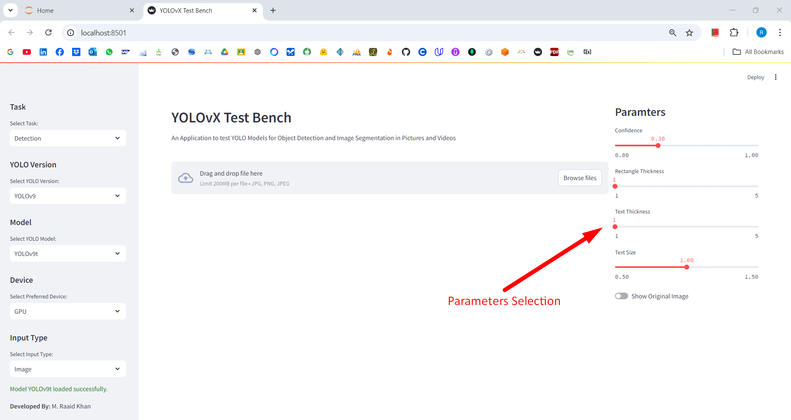
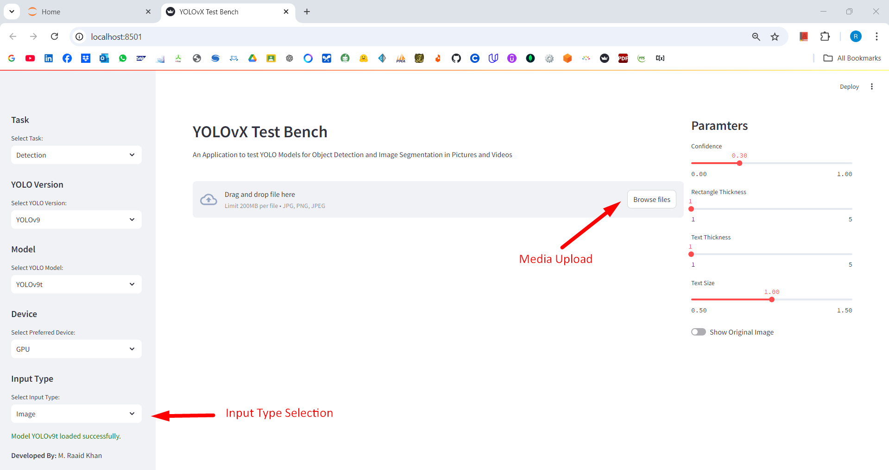
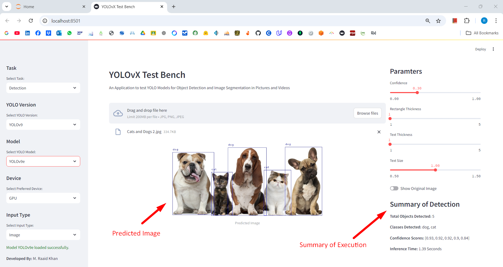
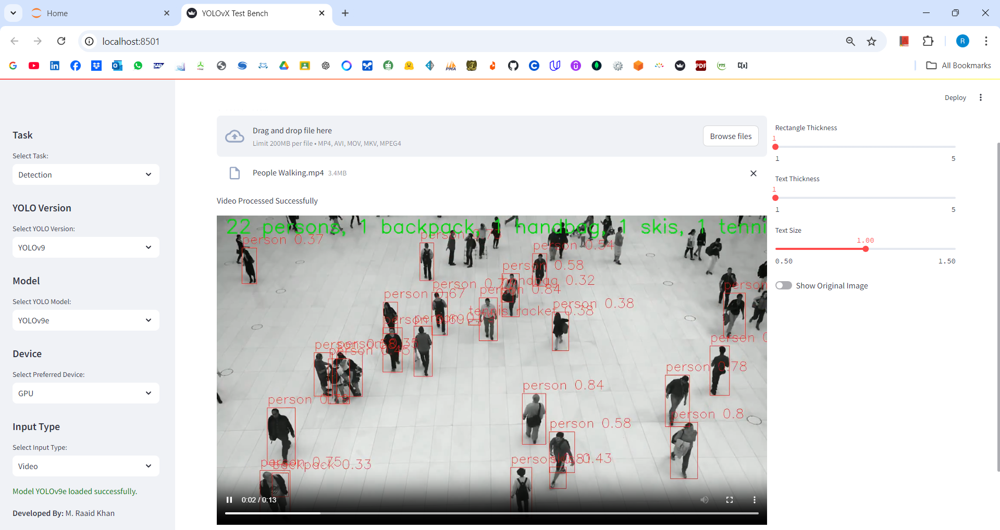

# <ins>Test Bench for YOLOvX Models

## <ins>Introduction
In the rapidly evolving field of computer vision, the demand for efficient and accurate object detection algorithms has intensified, driven by applications ranging from autonomous vehicles to real-time surveillance systems. Among various methodologies, **You Only Look Once (YOLO)** has emerged as a groundbreaking approach that fundamentally transforms how object detection tasks are approached. Introduced by Redmon et al. in 2016, YOLO redefined the landscape of object detection by adopting a unified architecture that enables simultaneous detection and classification of multiple objects within an image in a single pass. 

## <ins>System Specifications

This project develops a Test Bench to test various YOLO Models, that performs Object Detection for both Images and Videos. Below is the main window of the project.

|     |
| :-----------------------: |
| *Interface of Test Bench* |

### Hardware Specifications
The testbench is configured with high-performance hardware equipped with a multi-core GPU (NVIDIA RTX 3060) to facilitate accelerated and inference processes.

### Software Specifications
he environment is set up using Python with essential libraries, including TensorFlow or PyTorch for model implementation, OpenCV for image processing, and Matplotlib for data visualization. Additionally, specific YOLO implementations (i.e., YOLOv8, YOLOv9, YOLOv10, YOLOv11) are cloned from their respective repositories.

## <ins>Working of Test Bench

### Model and Hardware Selection
YOLO Models and preferred Hardware can be Sidebar by the users.
|          |
| :------------------------------: |
| *Selection of Models and Device* |
  
### Parameters Selection
User can select different Parameters as per the requirements.
|   |
| :-----------------------: |
| *Selection of Parameters* |

### Uploading of Media
Required media can be uploaded by the users from *Browse Files* button
|   |
| :-----------------------: |
| *Selection & Upload of Media* |

### Image Detection
The Image Detection feature of the Test Bench provides a seamless interface for users to perform object detection on static images.  After uploading of Image, the Test Bench performs Object Detection as per Selected Model and adjusted Parameters. After execution, *Summary of Detection* is shown at the Bottom-Right of Screen.

|   |
| :-----------------------: |
| *Image Detection Results* |

By enabling users to efficiently perform image detection, the Test Bench empowers researchers and practitioners to leverage the power of YOLO models for diverse applications, from automated quality control in manufacturing to advanced surveillance systems in security.

### Video Processing 
The Video Detection feature of the Test Bench allows users to analyze and detect objects in video streams, providing an efficient solution for real-time monitoring and surveillance applications. This functionality builds upon the robust capabilities of YOLO models to process multiple frames and deliver accurate detection results in dynamic environments.

After uploading of Video, the Test Bench processes the video for Detection of Objects. After successful processing, a video with Detected Objects with Bounding Boxes, Class Name and Confidence is shown. 
|   |
| :-----------------------: |
| *Video Detection Results* |

## <ins>Future Upgrades
As technology continues to evolve, there are numerous opportunities for enhancing the functionality and performance of the Test Bench for YOLO Models. The following upgrades are proposed to ensure that the system remains at the forefront of object detection capabilities and meets the growing demands of users:

1. **Integration of Advanced YOLO Versions**: While the current Test Bench supports YOLOv8 through YOLOv11, future updates could include the integration of the latest YOLO versions, such as YOLOvX or other emerging models. These versions often come with improvements in accuracy, speed, and efficiency, which could further enhance the Test Bench’s performance.
    
2. **Multi-Object Tracking**: Incorporating multi-object tracking capabilities would allow the Test Bench to not only detect objects in videos but also track their movements across frames. This feature would be particularly beneficial for applications such as surveillance, traffic analysis, and sports analytics, where understanding object trajectories is essential.
    
3. **Enhanced Data Visualization**: Future upgrades could focus on improving the data visualization aspect of the Test Bench. This may include more advanced graphical representations of detection results, such as heatmaps indicating object density, or providing insights into object interactions within a scene. Interactive visualizations could further enhance user engagement and understanding.
    
4. **User-Defined Model Training**: Introducing a feature that allows users to train custom YOLO models directly within the Test Bench could significantly increase its versatility. Users would be able to upload their own datasets and fine-tune models based on specific application requirements, making the system applicable to niche areas and specialized tasks.
## <ins>Conclusion
The development of the Test Bench for YOLO Models represents a significant advancement in the realm of object detection, providing users with a versatile and user-friendly platform for testing various YOLO versions. By leveraging high-performance hardware and robust software frameworks, this project facilitates efficient and accurate object detection for both images and videos.

The Test Bench's modular design allows users to select different YOLO models and hardware configurations tailored to their specific needs, enhancing the flexibility of object detection tasks. Moreover, the ability to adjust parameters such as confidence thresholds, text size, and rectangle thickness empowers users to fine-tune their detection processes according to the requirements of their applications.